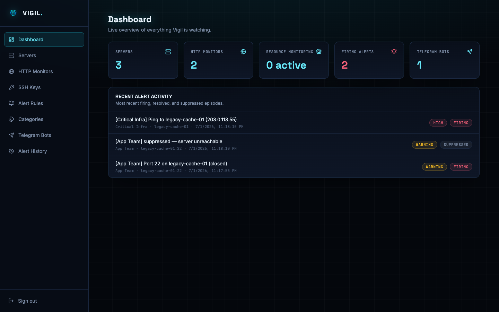
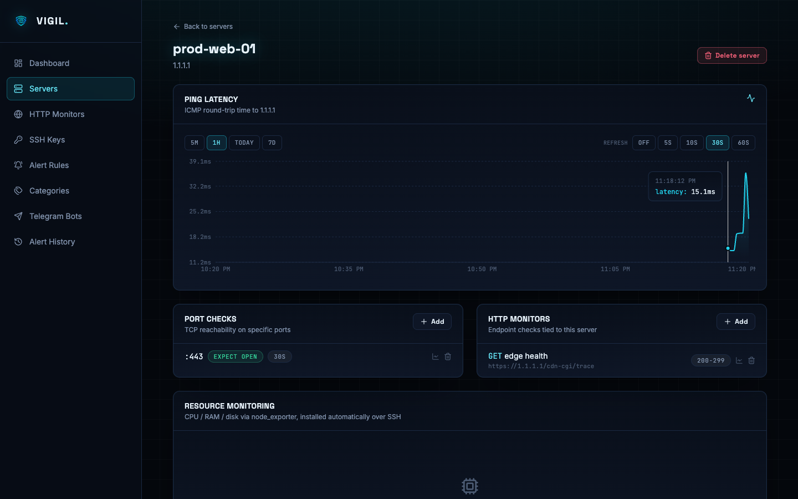
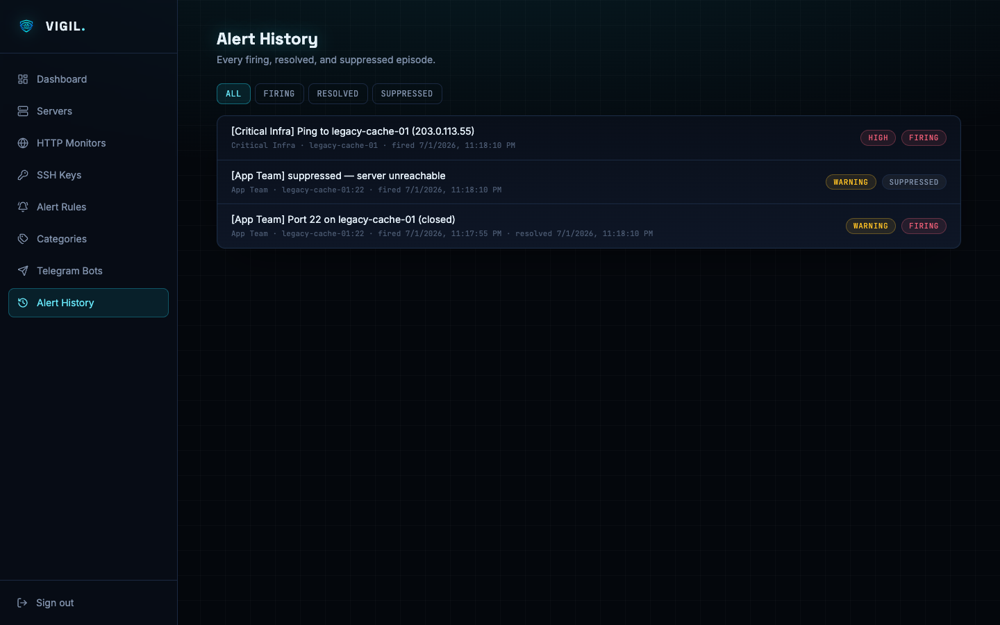
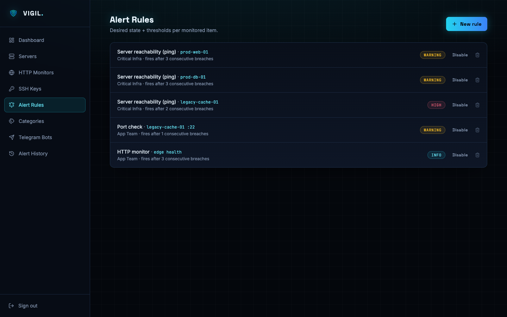
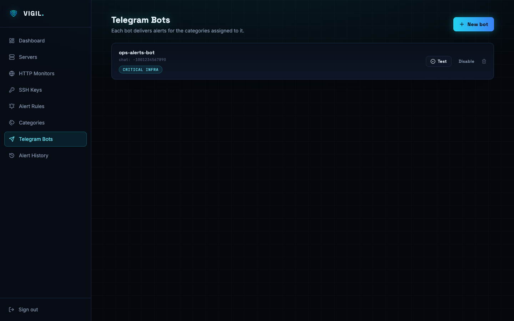
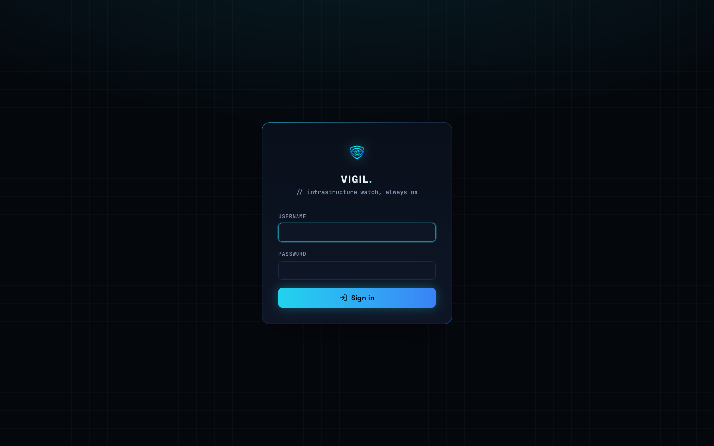
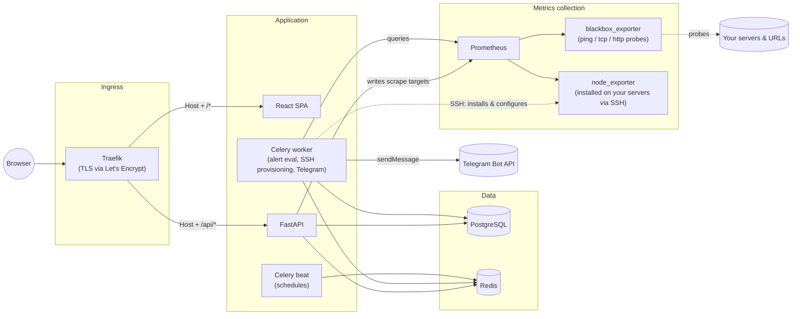
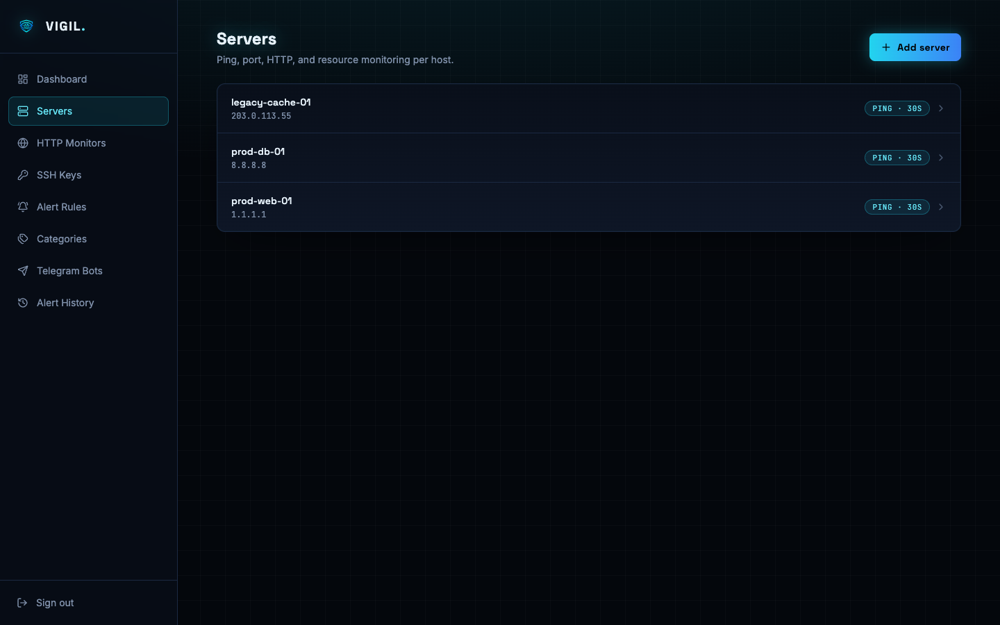
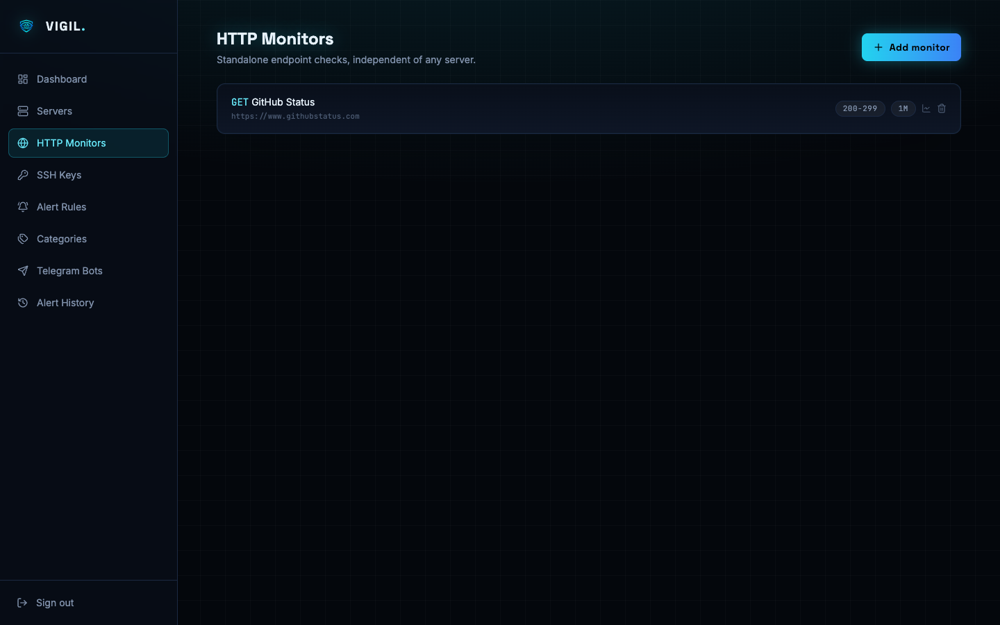
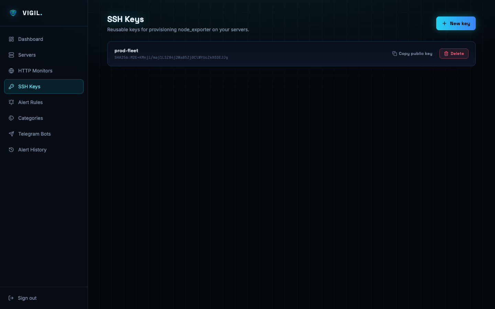

<div align="center">
  

  # Vigil

  **Self-hosted infrastructure & HTTP monitoring, with deduplicated Telegram alerting.**

  
  
  
  
  
</div>

---

Vigil watches your servers — reachability, TCP ports, HTTP(S) endpoints, and (once
`node_exporter` is provisioned) CPU / RAM / disk — plus any standalone HTTP
endpoints you care about, and routes categorized alerts into Telegram groups
through admin-defined bots.

The one thing Vigil is opinionated about: **when a whole server goes down, you
get one alert, not one per failing check on that host.** A downed server
usually breaks its ping, its open ports, and every HTTP endpoint on it at
once — Vigil recognizes that and sends a single "server down" alert instead of
paging you five times for the same outage.

## Contents

- [Screenshots](#screenshots)
- [Features](#features)
- [Architecture](#architecture)
- [Tech stack](#tech-stack)
- [Quickstart](#quickstart)
- [First login](#first-login)
- [Configuration reference](#configuration-reference)
- [Guide: monitoring a server](#guide-monitoring-a-server)
- [Guide: standalone HTTP monitors](#guide-standalone-http-monitors)
- [Guide: resource monitoring (CPU / RAM / disk)](#guide-resource-monitoring-cpu--ram--disk)
- [Guide: alert rules, categories & dedup](#guide-alert-rules-categories--dedup)
- [Guide: Telegram bots](#guide-telegram-bots)
- [Guide: historical graphs](#guide-historical-graphs)
- [Changing the domain](#changing-the-domain)
- [Project structure](#project-structure)
- [Local development](#local-development)
- [Troubleshooting](#troubleshooting)
- [Contributing](#contributing)
- [License](#license)

## Screenshots

|                                                                     |                                                                       |
| ------------------------------------------------------------------- | --------------------------------------------------------------------- |
| **Dashboard** — live overview, with a real dedup example in the feed | **Server detail** — ping latency graph, port/HTTP checks, resource monitoring |
|                         |                   |
| **Alert history** — firing / resolved / suppressed, filterable       | **Alert rules** — desired state + thresholds per monitored item        |
|                  |                        |
| **Telegram bots** — one bot per notification channel, by category    | **Login** — forced password change on first boot                       |
|                  |                                    |

## Features

- **Server monitoring** — ping reachability, arbitrary TCP ports, and HTTP(S)
  endpoints, each on its own admin-selected poll interval.
- **Standalone HTTP monitors** — the same endpoint-checking engine, for URLs
  that don't belong to any particular server.
- **Resource monitoring** — CPU, RAM, and per-partition disk usage, collected
  by `node_exporter`, which Vigil installs and configures on the target for
  you (see [below](#guide-resource-monitoring-cpu--ram--disk)).
- **Desired-state alerting** — every monitored item gets an admin-defined
  expected state (an HTTP status range, an open/closed port, a resource
  threshold), with a configurable severity (`info` / `warning` / `high`) and a
  flap-dampening window (N consecutive breaches before it actually fires).
- **Alert deduplication** — a server-down condition suppresses its dependent
  port/HTTP/resource alerts instead of firing all of them independently. See
  the [dedup guide](#guide-alert-rules-categories--dedup) for exactly how this
  works.
- **Categorized Telegram routing** — group alert rules into categories (e.g.
  *Critical Infra*, *App Team*), and assign each Telegram bot to the
  categories it should deliver — one incident, routed to the right channel.
- **Historical graphs** — every monitored item gets a themed chart (latency,
  status code, or resource usage) with `5m` / `1h` / `today` / `7d` presets and
  a configurable auto-refresh interval.
- **One domain to configure** — Traefik routing, Let's Encrypt certificates,
  and the frontend's API base URL all derive from a single `DOMAIN` value.
- **Forced password rotation** — the seeded admin account cannot reach the
  dashboard until the default password has been changed.

## Architecture



Prometheus scrape targets aren't static YAML — the backend writes
`file_sd` JSON target files to a shared volume whenever a server, port
check, or HTTP monitor is created, edited, or deleted, and Prometheus
picks up the change within seconds. The alert engine (a Celery Beat task)
polls Prometheus on a fixed cadence, evaluates each rule's desired state
with flap-dampening, and dispatches Telegram notifications through Celery
workers.

## Tech stack

| Layer               | Choice                                                             |
| -------------------- | -------------------------------------------------------------------- |
| Reverse proxy         | [Traefik](https://traefik.io/) v3, automatic Let's Encrypt certificates |
| API                   | [FastAPI](https://fastapi.tiangolo.com/) (Python 3.12) + SQLAlchemy 2.0 + Alembic |
| Database              | PostgreSQL 16                                                        |
| Queue / cache          | Redis 7 + [Celery](https://docs.celeryq.dev/) (worker + beat)           |
| Metrics collection     | [Prometheus](https://prometheus.io/) + [blackbox_exporter](https://github.com/prometheus/blackbox_exporter) + [node_exporter](https://github.com/prometheus/node_exporter) |
| SSH automation         | [Paramiko](https://www.paramiko.org/)                                  |
| Frontend               | React 19 + TypeScript + Vite + Tailwind CSS v4                        |
| Frontend data/state    | TanStack Query + Zustand                                              |
| Charts                 | Recharts                                                               |

## Quickstart

Requires Docker and Docker Compose.

```bash
git clone <this-repo-url> vigil
cd vigil
cp .env.example .env
```

Edit `.env`:

```bash
# generate these two:
python3 -c "import secrets; print(secrets.token_urlsafe(48))"   # -> SECRET_KEY
python3 -c "from cryptography.fernet import Fernet; print(Fernet.generate_key().decode())"  # -> FERNET_SECRET

# then set:
DOMAIN=monitoring.example.com   # must resolve to this host's public IP
ACME_EMAIL=you@example.com
POSTGRES_PASSWORD=<something-not-the-default>
```

Bring the stack up:

```bash
docker compose up -d --build
```

That's it — migrations run automatically on first boot (guarded against the
worker/API/beat containers racing each other on a brand-new database), and
the admin account seeds itself. Visit `https://<DOMAIN>`.

> **No public domain yet?** Vigil still runs — Traefik will just fail to
> issue a certificate until `DOMAIN` resolves to the host and ports 80/443
> are reachable from the internet. Everything else works over plain HTTP if
> you route around Traefik for local testing.

## First login

| | |
|---|---|
| Username | `SEED_ADMIN_USERNAME` (default `admin`) |
| Password | `SEED_ADMIN_PASSWORD` (default `Admin123!`) |

You will be required to set a new password before the dashboard becomes
reachable — this is enforced server-side, not just a UI redirect, so there's
no way to skip it.

## Configuration reference

All variables live in `.env` (copied from `.env.example`).

| Variable | Default | Description |
|---|---|---|
| `DOMAIN` | `vigil.vboom.io` | The only value most deployments need to change. Drives Traefik routing, ACME certs, and the frontend's API base URL. |
| `ACME_EMAIL` | — | Contact email for Let's Encrypt. |
| `ACME_CA_SERVER` | production LE URL | Set to the [staging URL](https://letsencrypt.org/docs/staging-environment/) while testing to avoid production rate limits. |
| `POSTGRES_USER` / `POSTGRES_PASSWORD` / `POSTGRES_DB` | `vigil` / _(change me)_ / `vigil` | Database credentials. |
| `REDIS_URL` | `redis://redis:6379/0` | General Redis connection. |
| `CELERY_BROKER_URL` / `CELERY_RESULT_BACKEND` | Redis DBs 1 / 2 | Celery's own Redis usage, kept in separate logical DBs. |
| `SECRET_KEY` | _(change me)_ | Signs JWTs. Generate a real one before deploying. |
| `FERNET_SECRET` | _(change me)_ | Encrypts SSH private keys and Telegram bot tokens at rest. Generate a real one before deploying. |
| `ACCESS_TOKEN_EXPIRE_MINUTES` | `30` | JWT access token lifetime. |
| `REFRESH_TOKEN_EXPIRE_DAYS` | `7` | Reserved for future refresh-token support. |
| `SEED_ADMIN_USERNAME` / `SEED_ADMIN_PASSWORD` | `admin` / `Admin123!` | First-boot admin account. Forced to change password on first login regardless of what you set here. |
| `PROMETHEUS_URL` | `http://prometheus:9090` | Internal address the backend/workers query. |
| `ALERT_EVAL_INTERVAL_SECONDS` | `15` | How often Celery Beat re-evaluates alert rules. |
| `NODE_EXPORTER_VERSION` | `1.8.2` | Pinned version installed on monitored servers, for reproducibility. |
| `NODE_EXPORTER_PORT` | `9100` | Port `node_exporter` binds to on targets. |
| `BACKEND_CORS_ORIGINS` | `["https://vigil.vboom.io"]` | Only needed if you serve the frontend from a different origin than the API (not the default same-domain Traefik setup). |

## Guide: monitoring a server



1. **Servers → Add server** — give it a name and a host/IP. Ping monitoring
   is on by default with a 30-second interval.
2. Open the server, then add **port checks** (TCP port + expected open/closed
   state) and **HTTP monitors** (URL, method, expected status codes) as
   needed — each with its own poll interval (`30s` / `1m` / `5m` / `15m`;
   Prometheus schedules scrapes per-job, so intervals are a curated list
   rather than arbitrary seconds).
3. Define [alert rules](#guide-alert-rules-categories--dedup) for whichever
   checks should actually notify someone.

## Guide: standalone HTTP monitors



Some URLs don't belong to a particular server (a third-party API, a CDN
endpoint, a status page). **HTTP Monitors** in the sidebar is the same
endpoint-checking engine without a server attached — same method/status-code/
interval options, same alerting and graphing.

## Guide: resource monitoring (CPU / RAM / disk)



CPU, RAM, and disk usage come from `node_exporter`, which has to run
bare-metal (not in a container) on the target. Vigil automates the install:

1. **SSH Keys → New key.** Either paste an existing private key or let Vigil
   generate a fresh RSA-4096 keypair for you — the private key is encrypted
   at rest and shown to you exactly once, at creation time.
2. Copy the displayed **public** key onto the target server's
   `~/.ssh/authorized_keys`. The SSH user needs to be `root` or have
   passwordless `sudo` — Vigil doesn't do interactive password-based sudo.
3. On the server's detail page, **Configure resource monitoring**, pick the
   SSH key, user, and port.
4. Vigil connects over SSH, detects the CPU architecture, downloads the
   pinned `node_exporter` release, verifies it, and installs it as a hardened
   systemd service. This step is safe to re-run.
5. The target needs to allow inbound TCP on `9100` from wherever Prometheus
   runs — this is a firewall rule Vigil can't make for you. Status goes
   `pending → installing → installed`, and only flips to **active** once
   Prometheus actually scrapes it — if it's stuck at "installed" but never
   "active", that's almost always the firewall.

SSH keys are reusable across as many servers as you like — save one, use it
everywhere.

## Guide: alert rules, categories & dedup

**Alert categories** are just named buckets (`Critical Infra`, `App Team`,
whatever fits your team) that connect alert rules to Telegram bots.

**Alert rules** attach to exactly one target — a server's ping, a port
check, an HTTP monitor, or a server's CPU/RAM/disk — and define:

- the desired state (for resource rules, a percentage threshold; for
  ping/port/HTTP, the item's own configured expectation)
- a severity level (`info` / `warning` / `high`)
- a category
- how many **consecutive breaches** are required before it actually fires
  (flap-dampening — higher means fewer false alarms on flaky checks, slower
  to alert)
- an optional custom message template

**Deduplication**: if a server's ping rule is currently firing, every other
rule on that same server (port checks, HTTP monitors, resource thresholds)
is short-circuited straight to a `suppressed` state for as long as the
outage lasts — no Prometheus query, no notification, no spam. The suppressed
episodes are still recorded (visible in **Alert History**) so you can see
what was masked by the outage, but only the one "server down" alert actually
reaches Telegram. A single port being down does **not** suppress unrelated
checks on the same server — only whole-server unreachability does.

## Guide: Telegram bots

1. Message [@BotFather](https://t.me/BotFather) on Telegram, run `/newbot`,
   and copy the token it gives you.
2. Add your bot to the group/channel you want alerts posted to, and grab the
   chat ID (the easiest way: temporarily add [@getidsbot](https://t.me/getidsbot)
   to the same chat, or call `getUpdates` on your bot's API URL after sending
   it a message).
3. **Telegram Bots → New bot** in Vigil — paste the token and chat ID, and
   check off which alert categories this bot should deliver.
4. Hit **Test** to confirm it can actually post before relying on it.

## Guide: historical graphs

Every monitored item — server ping, port check, HTTP monitor (response time
*and* status code), CPU, RAM, disk — has a themed chart wherever it appears
in the UI (inline on the server detail page, or behind a small chart icon
next to individual checks).

Each chart has its own:

- **Time range**: `5m`, `1h`, `today`, or `7d`
- **Auto-refresh**: off, or every `5s` / `10s` / `30s` / `60s`

The Y-axis domain is computed from the actual data (percentages are always
shown on a fixed 0–100 scale; everything else auto-scales with padding), and
axis ticks are formatted in the metric's real unit (`ms`, `%`, status code) —
not a normalized index.

## Changing the domain

Every domain-dependent value — Traefik's routing rules, ACME certificate
resolution, the frontend's API base URL — derives from the single `DOMAIN`
variable in `.env`. To move Vigil, change `DOMAIN`, restart the stack
(`docker compose up -d`), and point DNS at the new host.

## Project structure

```
backend/
  app/
    api/v1/        FastAPI routers (one file per resource)
    core/           config, security (JWT/bcrypt), Fernet encryption, shared constants
    db/             SQLAlchemy session/engine, advisory-lock-guarded migration runner
    models/         SQLAlchemy models
    schemas/        Pydantic request/response models
    services/       Prometheus queries + file_sd writer, SSH provisioning, Telegram, alert engine
    tasks/          Celery tasks (alert evaluation, provisioning, dispatch)
  alembic/          Migrations
frontend/
  src/
    components/     Shared UI (design system + MetricChart)
    pages/          One file per route
    lib/            API client, types, chart utilities
    store/          Zustand auth store
prometheus/
  prometheus.yml    Static scrape config (job definitions are fixed; only file_sd contents change at runtime)
  file_sd/          Dynamically-written target files (gitignored)
blackbox_exporter/
  blackbox.yml      Probe module definitions (icmp / tcp_connect / http_2xx per method)
traefik/
  traefik.yml       Static Traefik config (entrypoints, ACME resolver)
docs/
  screenshots/      Images used in this README
```

## Local development

Run the infrastructure in Docker and iterate on the app outside it:

```bash
docker compose up -d postgres redis prometheus blackbox_exporter
```

**Backend** (needs Python 3.12+):

```bash
cd backend
python3 -m venv .venv && source .venv/bin/activate
pip install -r requirements.txt
export $(grep -v '^#' ../.env | xargs)   # or set POSTGRES_HOST=localhost etc. manually
alembic upgrade head
uvicorn app.main:app --reload
```

**Celery** (in separate terminals, same env):

```bash
celery -A app.celery_app worker --loglevel=info
celery -A app.celery_app beat --loglevel=info
```

**Frontend** (needs Node 20.19+):

```bash
cd frontend
npm install
npm run dev
```

The Vite dev server proxies `/api` to `http://localhost:8000` (see
`vite.config.ts`), so the backend needs to be reachable on port 8000 — the
default `docker-compose.yml` publishes it to `127.0.0.1:8000` for exactly
this reason.

## Troubleshooting

**Traefik never gets a certificate.** `DOMAIN` needs to resolve (A/AAAA) to
the host, and ports 80/443 need to be reachable from the internet for the
HTTP-01 challenge. Check `docker compose logs traefik` — Let's Encrypt's
error messages are usually specific about what failed.

**A server's resource monitoring is stuck on "installed" but never
"active".** The SSH steps succeeded, but Prometheus can't reach port `9100`
on the target — almost always a firewall rule. Open `9100` to the host
running Prometheus.

**node_exporter provisioning fails outright.** Usually one of: the public
key isn't in the target's `authorized_keys` yet, the SSH user doesn't have
passwordless sudo, or the host key changed since the last successful connect
(Vigil pins it on first connect and refuses to silently continue if it
changes later — re-verify manually if you've reimaged the box).

**Telegram bot "Test" fails.** Double check the token (from BotFather) and
that the bot has actually been added to the target chat/channel/group with
permission to post.

## Contributing

Issues and pull requests are welcome. If you're planning something
substantial, open an issue first to talk through the approach — the alert
engine and Prometheus target-management code in particular have some
non-obvious invariants (documented inline) that are easy to break
accidentally.

## License

Not yet finalized — a LICENSE file will be added before the first public
release. Until then, treat this as all-rights-reserved.
